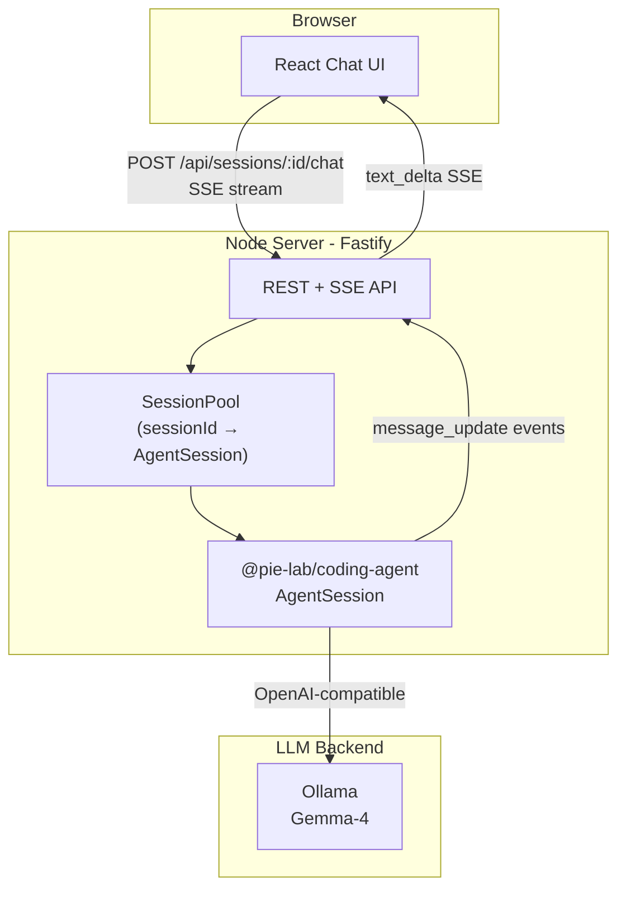
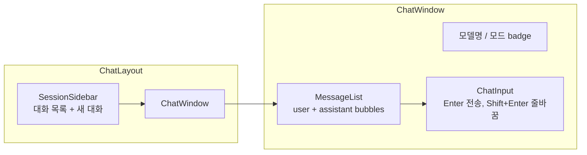

# pie-gemma4 챗봇 아키텍처 계획

> pie SDK를 Node 백엔드에 임베드하고, React 챗 UI가 SSE로 스트리밍 응답을 받는 2-tier 구조. env로 chat-only / full-agent 모드 전환.

## 목표

프롬프트 입력 → pie가 답변하는 **웹 챗봇 UI**. pie CLI의 핵심 기능(세션, 스트리밍, 모델 연동)을 활용하되, 커스텀 UI를 위해 **SDK 임베드 방식**을 채택한다.

> pie 공식 권장: 커스텀 UI는 `@pie-lab/coding-agent` SDK의 `createAgentSession()` 사용. RPC subprocess는 다언어/격리 필요 시 대안.

## 전체 구조



## 기술 스택

| 레이어 | 선택 | 이유 |
|--------|------|------|
| Frontend | Vite + React + TypeScript | 가볍고 SSE 소비 간단, inganmi-app과 React 스택 일치 |
| Backend | Fastify + TypeScript | SSE/스트리밍 지원 좋음, pie SDK(Node 22+)와 동일 런타임 |
| pie 연동 | SDK in-process | 타입 안전, 이벤트 스트리밍 직접 구독, 세션 상태 접근 |
| LLM | Ollama (Gemma-4) | [README.md](../README.md) 기존 설정과 일치 |
| 스타일 | Tailwind CSS | 빠른 챗 UI 구성 |

## 프로젝트 디렉터리

```
pie-gemma4/
├── README.md                    # 기존 pie CLI 문서 + 앱 실행법 추가
├── package.json                 # npm workspaces root
├── .env.example
├── .gitignore
├── docs/
│   └── plan.md                  # 본 문서
├── apps/
│   ├── server/                  # pie SDK 백엔드
│   │   ├── src/
│   │   │   ├── index.ts         # Fastify 부트
│   │   │   ├── config.ts        # env 파싱 (모드, 모델, API URL)
│   │   │   ├── pie/
│   │   │   │   ├── factory.ts   # createAgentSession 래퍼
│   │   │   │   └── session-pool.ts  # sessionId ↔ AgentSession 관리
│   │   │   └── routes/
│   │   │       ├── sessions.ts  # CRUD
│   │   │       └── chat.ts      # SSE 스트리밍
│   │   └── package.json
│   └── web/                     # React 챗 UI
│       ├── src/
│       │   ├── App.tsx
│       │   ├── components/
│       │   │   ├── ChatWindow.tsx
│       │   │   ├── MessageList.tsx
│       │   │   ├── MessageBubble.tsx
│       │   │   ├── ChatInput.tsx
│       │   │   └── SessionSidebar.tsx
│       │   ├── hooks/
│       │   │   ├── useChat.ts       # SSE consume
│       │   │   └── useSessions.ts
│       │   └── api/client.ts
│       └── package.json
└── .pie/
    └── settings.json            # pie 프로젝트 로컬 설정 (pie install -l)
```

## pie SDK 연동 핵심

`createAgentSession()` 기반 팩토리:

```typescript
// apps/server/src/pie/factory.ts (개념)
import {
  createAgentSession,
  SessionManager,
  AuthStorage,
  ModelRegistry,
} from '@pie-lab/coding-agent';

export async function createChatSession(cwd: string, mode: 'chat' | 'agent') {
  const authStorage = AuthStorage.create();
  authStorage.setRuntimeApiKey('openai', process.env.OPENAI_API_KEY!);

  const modelRegistry = ModelRegistry.create(authStorage);
  const model = modelRegistry.find('openai', process.env.MODEL_NAME!);

  const tools =
    mode === 'chat'
      ? ['read', 'grep', 'find', 'ls'] // read-only
      : ['read', 'bash', 'edit', 'write']; // full agent

  const { session } = await createAgentSession({
    cwd,
    model,
    tools,
    sessionManager: SessionManager.inMemory(cwd),
    authStorage,
    modelRegistry,
  });

  return session;
}
```

이벤트 구독 → SSE 변환:

```typescript
session.subscribe((event) => {
  if (
    event.type === 'message_update' &&
    event.assistantMessageEvent.type === 'text_delta'
  ) {
    sse.write(
      `data: ${JSON.stringify({ type: 'delta', text: event.assistantMessageEvent.delta })}\n\n`,
    );
  }
  if (event.type === 'agent_end') {
    sse.write(`data: ${JSON.stringify({ type: 'done' })}\n\n`);
  }
});
await session.prompt(userMessage);
```

## API 설계

| Method | Path | 설명 |
|--------|------|------|
| `POST` | `/api/sessions` | 새 대화 생성 → `{ sessionId, name }` |
| `GET` | `/api/sessions` | 세션 목록 |
| `GET` | `/api/sessions/:id/messages` | 대화 히스토리 (`session.messages`) |
| `POST` | `/api/sessions/:id/chat` | 프롬프트 전송, **SSE 스트리밍** 응답 |
| `POST` | `/api/sessions/:id/abort` | 진행 중 응답 중단 (`session.abort()`) |
| `DELETE` | `/api/sessions/:id` | 세션 제거 |

### SSE 이벤트 포맷

```json
{ "type": "delta", "text": "Hello" }
{ "type": "tool_start", "toolName": "bash" }
{ "type": "tool_end", "toolName": "bash", "isError": false }
{ "type": "error", "message": "..." }
{ "type": "done" }
```

프론트는 `delta`만 챗 버블에 append, agent 모드에서는 `tool_*` 이벤트를 별도 UI(접이식 패널)로 표시.

## 환경 변수 (`.env.example`)

```bash
# Server
PORT=3001
PIE_MODE=chat          # chat | agent  (도구 범위 전환)
PIE_CWD=./             # pie 작업 디렉터리

# Ollama / OpenAI-compatible
OPENAI_API_KEY=ollama
OPENAI_BASE_URL=http://localhost:11434/v1
MODEL_NAME=xentriom/gemma-4-12B-coder-fable5-composer2.5-v1

# Web (Vite proxy)
VITE_API_URL=http://localhost:3001
```

- **`PIE_MODE=chat`**: `read,grep,find,ls` — 웹 노출 안전
- **`PIE_MODE=agent`**: bash/edit/write 포함 — **로컬 전용**, CORS/방화벽으로 외부 차단 권장

## 프론트엔드 UI 구성



- **MessageBubble**: markdown 렌더 (react-markdown), 코드블록 syntax highlight
- **스트리밍**: assistant 버블에 delta 실시간 append, `done` 시 커서 제거
- **로딩/중단**: 전송 중 Stop 버튼 → `POST /abort`
- **세션**: sidebar에서 이전 대화 선택 → `GET /messages`로 히스토리 복원

## 세션/상태 관리

- **서버 메모리**: `Map<sessionId, AgentSession>` — MVP 충분
- **재시작 복원** (Phase 2): `SessionManager.create(cwd)` + `.pie/sessions/` 파일 persistence
- **동시 요청**: sessionId당 `isStreaming` 체크, streaming 중이면 409 또는 `steer`/`followUp` 큐잉

## 보안 고려사항

| 위험 | 대응 |
|------|------|
| agent 모드에서 bash/edit/write 원격 실행 | 기본 `PIE_MODE=chat`, agent는 localhost only |
| API 무인증 접근 | MVP는 localhost bind (`127.0.0.1`), Phase 2에 API key |
| CORS | Vite dev proxy로 same-origin, prod는 reverse proxy |

## 구현 단계

### Phase 1 — MVP (채팅 동작)

- [x] monorepo scaffold (`apps/server`, `apps/web`)
- [x] pie SDK factory + SessionPool
- [x] `/api/sessions`, `/api/chat` SSE 엔드포인트
- [x] React 챗 UI (입력 → 스트리밍 응답)
- [x] Ollama Gemma 연동 검증
- [x] README에 실행법 추가

### Phase 2 — UX/기능

- [ ] 세션 sidebar + 히스토리 복원
- [ ] tool 실행 UI (agent 모드)
- [ ] extension UI request 처리 (confirm/select 모달)
- [ ] 세션 파일 persistence (`SessionManager.create`)
- [ ] markdown/code highlight polish

### Phase 3 — 운영 (선택)

- [ ] Docker Compose (web + server + ollama)
- [ ] API 인증
- [ ] RPC fallback 옵션 (Python 등 다른 언어 백엔드 필요 시)

## 대안: RPC subprocess (참고)

SDK 대신 `pie --mode rpc` subprocess + `RpcClient`도 가능. 다만 동일 Node 프로젝트에서는 SDK가 더 단순하고, 공식 예제 `examples/rpc-extension-ui.ts`는 TUI용. **본 프로젝트는 SDK 우선, RPC는 Phase 3 fallback**.

## 로컬 실행 (목표)

```bash
# Ollama + Gemma 모델 준비
ollama pull <model>

# 의존성
npm install

# 개발
npm run dev          # server:3001 + web:5173 (proxy)

# 환경
cp .env.example .env
PIE_MODE=chat npm run dev
```

## 참고 문서

- pie SDK: `@pie-lab/coding-agent` 패키지 `docs/sdk.md`
- pie RPC: `@pie-lab/coding-agent` 패키지 `docs/rpc.md`
- pie CLI: [README.md](../README.md)
